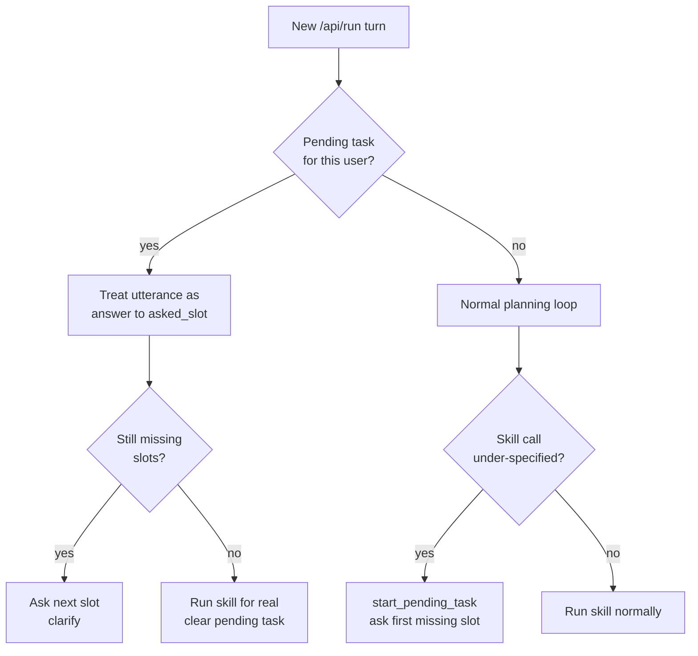

# Technical Documentation — Dialogue Management

Architecture of the guided, paced, multi-turn dialogue system built for the
"Simplified Voice Interaction for Users with Cognitive Challenges" problem
statement. Audience: engineers/judges evaluating the implementation. For the
user-facing description, see [`USER_GUIDE.md`](USER_GUIDE.md).

## The gap this closes

Every `/api/run` call was previously fully stateless: `run_pipeline()` ran
ASR → analysis → intent → RAG → agent → response from scratch, with no
memory of any previous turn beyond the personalization corrections store
(`src/knowledge/personalization.py`). The agent could already ask a
clarifying question (`AgentResult.clarification`), but the *next* utterance
was processed as an unrelated new request — there was no mechanism to know
"this reply answers the question I just asked." Cognitive-friendly, paced,
slot-filling dialogue is fundamentally impossible without that memory, so
this was the one genuine architectural gap between what was built for the
original PRD and what this problem statement requires.

## Design: declarative slots + a small per-user state machine

Three pieces, each intentionally minimal:

### 1. `Skill.required_slots` (`src/skills/base.py`)

A skill opts into pacing by declaring which parameters it cannot proceed
without, mapped to the plain-language question for each:

```python
class ScheduleReminderSkill(Skill):
    required_slots = {
        "subject": "What should I remind you about?",
        "time": "When should I remind you? For example, 'tomorrow at 5pm'.",
    }
```

Declaration order is question order. `Skill.missing_slots(params)` returns
whichever declared slots aren't yet filled with a non-empty value. Skills
that don't declare any (`faq_lookup`, `general_help`) are entirely
unaffected — pacing is opt-in per skill, not a pipeline-wide behavior.

### 2. `PendingTask` (`src/understanding/dialogue_state.py`)

```python
@dataclass
class PendingTask:
    user_id: str
    skill_name: str
    filled_slots: Dict[str, Any]
    asked_slot: Optional[str]   # which question is currently open
    turns: int                 # safety-cap counter
    original_utterance: str
```

A module-level dict, `_pending: Dict[str, PendingTask]`, keyed by
`user_id`. Deliberately **in-memory, not persisted** — a half-answered
question shouldn't survive a server restart, unlike a completed reminder
(see below), and this mirrors the existing scope of
`src/knowledge/personalization.py`: one server process, one demo, not a
multi-instance deployment. `MAX_DIALOGUE_TURNS = 6` bounds how long one
guided dialogue can run before the system gives up and resets, the same
protection the agent's own `max_steps` cap gives within a single turn.

### 3. Agent integration (`src/agent/agent.py`)

`run_agent()` checks for an open dialogue *before* doing any LLM-based
planning:

```python
user_id = getattr(ctx.get("user_memory"), "user_id", None)
if user_id:
    pending = dialogue_state.get_pending_task(user_id)
    if pending:
        return _continue_pending_dialogue(pending, accessible_text, skills, ctx)
```

`_continue_pending_dialogue` treats the current turn's accessible transcript
as the answer to `pending.asked_slot`, then either:
- asks the next missing slot (`clarify`, same as a first-time ambiguous
  request), or
- calls the skill for real, now that every slot is filled, and clears the
  pending task.

A dialogue is *started* the same way any first-time missing-info case
would be, just inside the existing `call_skill` branch of the normal
planning loop: if the planner's chosen skill is missing something,
`start_pending_task()` is called instead of running the skill
half-specified, and the agent returns a `clarify` step for the first
missing slot.



This required no new API endpoint and no frontend changes: the existing
`agent_result.clarification` → banner/confirm-buttons wiring (built for the
original single-shot ambiguity case) already displays whatever question is
currently open. Pacing is invisible to the transport layer; it only changes
what the agent decides to do with a turn.

## Pipeline-level integration (`src/pipeline.py`)

Three small, targeted changes:

1. **Skip wasted work while continuing a dialogue.** `extract_intent()` and
   `rag_retrieve()` are both skipped when `dialogue_state.get_pending_task(user_id)`
   is truthy at the start of the turn — neither is consulted by
   `_continue_pending_dialogue`, so calling them would be pure wasted
   LLM cost/latency on a flow that's already multi-turn by nature. This
   matters more here than elsewhere: a paced dialogue is *several* HTTP
   round trips, so per-turn savings compound.

2. **The clarifying question becomes the response verbatim.**
   `generate_grounded_response()` (an LLM synthesis call) is skipped
   entirely when `agent_result.clarification` is set — the response is the
   question, unparaphrased. This is deliberate: letting an LLM "improve" a
   plain one-sentence question risks exactly the kind of longer, vaguer
   phrasing the whole feature exists to avoid, and it saves another LLM
   call.

3. **Recovery options during an open dialogue exclude "Confirm."** There's
   nothing to confirm yet mid-dialogue — the response is a question, not a
   proposed action — so offering a Confirm button would be confusing.
   Correct / Retry / Switch Modality still apply.

## Backend integration: `src/integrations/reminders_store.py`

`ScheduleReminderSkill` previously returned a formatted string with no
persistence at all. It now writes to a real SQLite database
(`.reminders.db`, gitignored, stdlib `sqlite3` — zero new dependency),
genuinely surviving a server restart. `ListRemindersSkill` reads it back,
so task completion is verifiable, not just claimed. Swapping in a real
third-party calendar API later means changing the three functions in
`reminders_store.py` (`create_reminder`, `list_reminders`,
`delete_reminder`); neither the skill nor the dialogue layer needs to
change, matching this codebase's existing Mock/Local/Event backend-swap
pattern used everywhere else.

## A pre-existing bug this surfaced and fixed

`MockLLMBackend._response()` (`src/llm.py`) unconditionally ignored the
`skill_output` parameter and always echoed `"Understood: {transcript}"` —
even when a skill had already produced a real result. This predates the
dialogue-management work but went unnoticed because nothing previously
relied on a skill's actual output being surfaced under the free/offline
mock profile. Fixed to surface `skill_output` when present, matching what
`RESPONSE_SYSTEM_PROMPT` already instructs a real LLM to do. Without this
fix, a completed reminder under `PROFILE=mock` (the safe demo-day default)
would have looked like nothing happened, even though it had.

## Known scope limits

- **Single-server-process, single-demo-user scope.** `dialogue_state` and
  `server.py`'s `_USER_ID = "demo-user"` both assume one shared demo user,
  matching every other piece of per-user state in this codebase
  (`UserMemory`). Multiple concurrent users would need per-session user
  IDs threaded through the frontend — not built, since the demo is single
  presenter/single laptop.
- **No persistence of in-progress dialogue.** A server restart mid-dialogue
  loses the open question (by design — see above) but never loses a
  completed reminder.
- **Mock-profile pacing is more eager than a real LLM's would be.** The
  mock planner never extracts named parameters from free text (see
  `MockLLMBackend._agent_step`), so under `PROFILE=mock` almost every
  reminder-shaped request triggers the paced dialogue, even ones a real
  NLU model might parse in one shot. This is actually useful for
  demoing/testing the mechanism deterministically without a real LLM, and
  real backends (`ollama`/`event`) only pace for genuinely missing
  information, which is the intended behavior described in the user guide.
